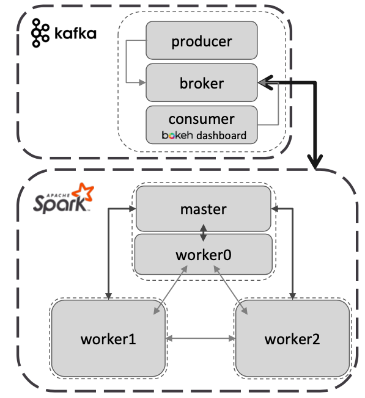
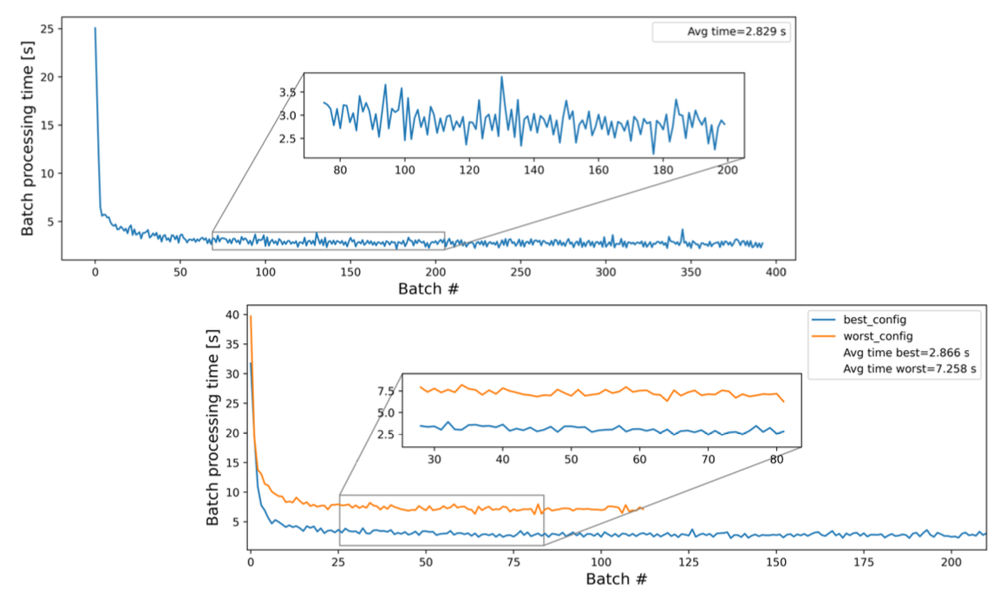
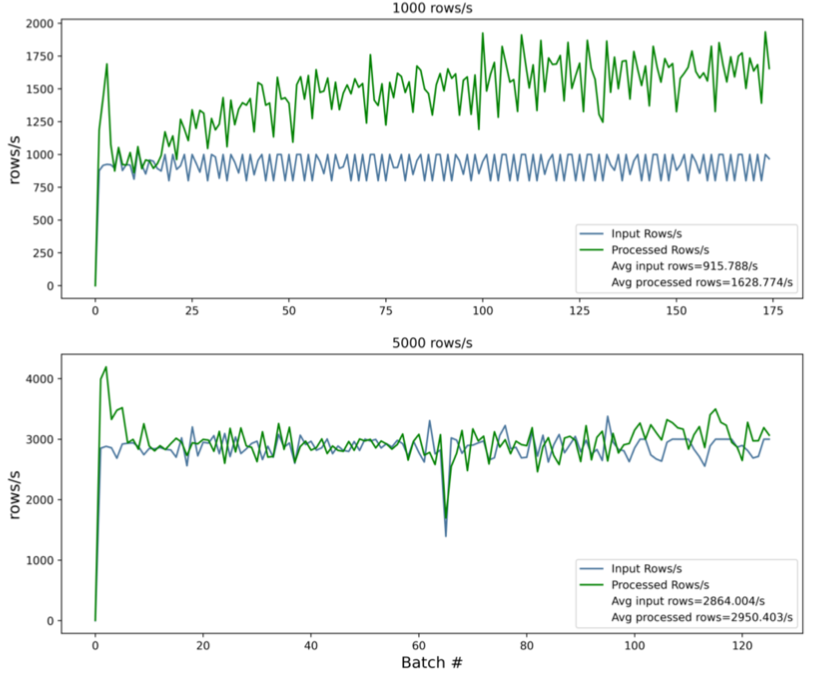
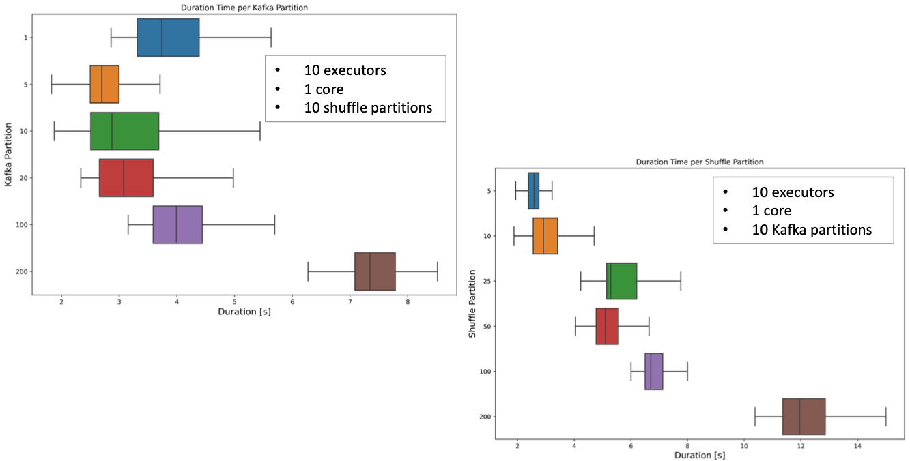

# Streaming processing of cosmic rays using Drift Tubes detectors

The final dashboard is available at this link: https://youtu.be/3Sd7UJH7IFg


## Goal of the project

* Set up a cluster on CloudVeneto (**AWS**).

* Simulating a continuous Data acquisition stream from a particle physics detector by injecting the provided dataset into a **Kafka** topic. The dataset is hosted in a CloudVeneto bucket.

* Process the data using **Spark** and send the results to a **real-time dashboard** (Bokeh). 

## Network architecture



### Producer
 
- Connect to the cluster -> `KAFKA_BOOTSTRAP_SERVER`

- Define a producer

- Create two topics -> data_raw, data_clean ; define the number of partitions and the replication factor

```python3
data_raw = NewTopic(name='data_raw', 
                        num_partitions=10,                      
                        replication_factor=1)                     #replication factor is 1 (no replication) because we have one broker    

data_clean = NewTopic(name='data_clean', 
                          num_partitions=1, 
                          replication_factor=1)

kafka_admin.create_topics(new_topics=[data_raw, data_clean])
kafka_admin.list_topics()

```

- Connect to s3 bucket
- Send message asynchronously -> `KafkaProducer.send()`
- Full batch -> `KafkaProducer.flush()`

```python3
### loop into s3 bucket and send batches to the broker simulating a streaming data

for obj in list_obj_contents:
    
    #load each txt file into pandas dataframe
    
    df=pd.read_csv(s3_client.get_object(Bucket='##', Key=obj['Key']).get('Body'), sep=' ')
    df.rename(columns = {'HEAD,FPGA,TDC_CHANNEL,ORBIT_CNT,BX_COUNTER,TDC_MEAS':'values'}, inplace = True)
    
    "..."

        # append a record to the msg to send
        producer.send('data_raw', row)
        
        
    "..."
        #send message to the topic when we reach batch size 
        if batch_counter==batch_size:
            producer.flush()
            # sleep time
            time.sleep(wait_time)
            batch_counter=0
            
    # send last batch 
    producer.flush()

```

### Spark analysis

* Session and Context creation

* Vary these parameters to test performance:

  - `spark.executor.instances`: n° of executors 

  - `spark.executor.cores`: n° of CPU cores for each executor

  - `spark.sql.shuffle.partitions`: n° of partitions used when shuffling for joins/aggregations

  - `spark.sql.execution.arrow.pyspark.enabled`: in memory columnar format → no major differences→left `true`

* Producer creation -> send the final message to the `data_clean` topic

```python3
# read streaming df from kafka
inputDF = spark\
    .readStream\
    .format("kafka")\
    .option("kafka.bootstrap.servers", KAFKA_BOOTSTRAP_SERVER)\
    .option("kafkaConsumer.pollTimeoutMs", 1000)\
    .option('subscribe', 'data_raw')\
    .option("startingOffsets", "latest") \
    .load()

"(...)"

# extract the value from the kafka message
rawraw_data = inputDF.select(col("value").cast("string")).alias("csv")

# split the csv line in the corresponding fields
raw_data = rawraw_data.selectExpr("cast(split(value, ',')[0] as int) as HEAD",
                                   "cast(split(value, ',')[1] as int) as FPGA",
                                   "cast(split(value, ',')[2] as int) as TDC_CHANNEL",
                                   "cast(split(value, ',')[3] as long) as ORBIT_CNT",
                                   "cast(split(value, ',')[4] as int) as BX_COUNTER",
                                   "cast(split(value, ',')[5] as double) as TDC_MEAS")


```

**Batch processing**:

  - total number of processed hits: `hit_count`

  - total number of processed hits per chamber: `hit_count_chamber`

  - histogram of the counts of active `TDC_CHANNEL`, per chamber: `ch*_tdc_counts_list` - histogram of the total number of active `TDC_CHANNEL`
  in each `ORBIT_CNT`, per chamber: `ch*_orbit_counts_list` • Create JSON message→send to topic 


```python3

# function to apply to each batch: writes and sends a kafka message at the end
def batch_processing(df, epoch_id):

    df = df.persist()

    # 1: total number of processed hits, post-cleansing (1 value per batch)
    
    hit_count = df.count()
    
    # 2: total number of processed hits, post-cleansing, per chamber (4 values per batch)

    hit_count_chamber = df.groupby('CHAMBER').agg(count('TDC_CHANNEL').alias('HIT_COUNT'))\
                        .sort("CHAMBER").select('HIT_COUNT')\
                        .agg(collect_list('HIT_COUNT')).collect()

    # 3: histogram of the counts of active TDC_CHANNEL, per chamber (4 arrays per batch)

    tdc_counts = df.groupby(['CHAMBER','TDC_CHANNEL']).agg(count('TDC_CHANNEL').alias('TDC_COUNTS'))
    tdc_counts = tdc_counts.persist()
    
   "(...)"

    # 4: histogram of the total number of active TDC_CHANNEL in each ORBIT_CNT, per chamber (4 arrays per batch)

    orbit_count=df.groupby(['CHAMBER','ORBIT_CNT']).agg(countDistinct("TDC_CHANNEL").alias('TDC_ORBIT'))
    orbit_count = orbit_count.persist()

    "(...)"

    df.unpersist()
    tdc_counts.unpersist()
    orbit_count.unpersist()
        
    "(...)"

    # prepare message to send to kafka
    
    msg = {

        'msg_ID': ID,
        'hit_count': hit_count,
        'hit_count_chamber': hit_count_chamber[0][0],
        "(..,)"
    }
   
    producer.send('data_clean', json.dumps(msg).encode('utf-8'))
    producer.flush()
   

# Apply function to the streaming dataset

query = raw_data.writeStream\
            .outputMode("update")\
            .foreachBatch(batch_processing)\
            .option("checkpointLocation", "checkpoint")\
            .trigger(processingTime='5 seconds')\
            .start()
query.awaitTermination(5)
```

### Consumer - Dashboard

* Create consumer

```python3

# Initialize Kafka consumer by subscribing to the topic
consumer = KafkaConsumer('data_clean',
                         bootstrap_servers = KAFKA_BOOTSTRAP_SERVER)
                        
```

* Poll messages

```python3

def polling():
    for msg in consumer:
        value = json.loads(msg.value.decode('utf-8'))  # Convert the message value to a dictionary
        break
    return value


    def create_value():
    
    #instantiate dictionary
    combined_dict = {}
    
    poll = polling()
    
    x = poll["msg_ID"]
    y = poll['hit_count'] 
    combined_dict["p1"] = {"x": [x], "y": [y]}  

    "..."
    
    return combined_dict

  ```

  * Create periodic function and launch the dashboard with `bokeh serve --show consumer_dashboard.py`

  # aggiungi gif dashboard se si può

## Metrics analysis

How does performance change by varying the following parameters?

* Number of executors (and cores)→10 (1 core), 3 (2, 4, 4 cores), 5 (2 cores)

* Number of Kafka partitions→1, 5, 10, 100, 200

* Number of shuffle partitions→5, 10, 25, 50, 100, 200

* Input rows→1000, 5000 rows/






